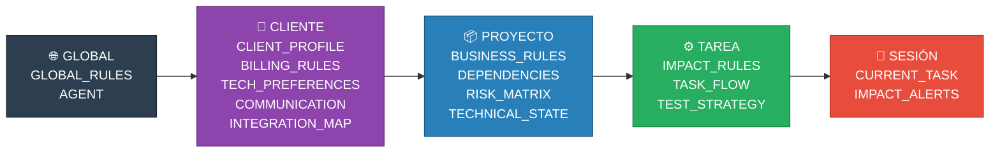

# brain-contexts — Diagrama de flujo

## Flujo completo

```mermaid
flowchart TD
    classDef dev fill:#4A90D9,stroke:#2C5F8A,color:#fff,rx:6
    classDef agent fill:#27AE60,stroke:#1A7A42,color:#fff,rx:6
    classDef brain fill:#8E44AD,stroke:#5E2D7A,color:#fff,rx:6
    classDef file fill:#F39C12,stroke:#B7770D,color:#fff,rx:6
    classDef decision fill:#E74C3C,stroke:#A93226,color:#fff,rx:6
    classDef system fill:#2C3E50,stroke:#1A252F,color:#fff,rx:6

    %% ─────────────────────────────────────────
    %% ZONA 1 — SETUP INICIAL (una sola vez)
    %% ─────────────────────────────────────────

    START([Inicio]):::system

    START --> FIRST_RUN{¿Repo registrado\nen context-map?}:::decision

    FIRST_RUN -- No --> SCAN[Dev ejecuta\nbrain claude\ndesde el repo]:::dev
    SCAN --> DETECT[detect-context.sh\ndetecta repos hermanos]:::system
    DETECT --> ASK_SCAN{¿Escanear\ntoda la carpeta?}:::decision

    ASK_SCAN -- Sí --> SCAN_ALL[scan-folder.sh\nprocesa cada repo]:::system
    ASK_SCAN -- No --> POPULATE_ONE[populate-context.sh\npara este repo]:::system

    SCAN_ALL --> POPULATE_EACH[populate-context.sh\npor cada repo]:::system
    POPULATE_EACH --> GENERATE[Claude genera\nBUSINESS_RULES\nDEPENDENCIES\nTECHNICAL_STATE\nRISK_MATRIX\nIMPACT_RULES\nTASK_FLOW\nTEST_STRATEGY]:::agent

    POPULATE_ONE --> GENERATE

    GENERATE --> POST_SCAN[scan-folder genera\nCLIENT_PROFILE.md\nINTEGRATION_MAP.md]:::agent

    POST_SCAN --> CONTEXT_MAP[Registra en\ncontext-map.json]:::brain
    CONTEXT_MAP --> COPY_TASK[Copia CURRENT_TASK.md\nal repo +\nagrega a .gitignore]:::system

    %% ─────────────────────────────────────────
    %% ZONA 2 — SESIÓN DE TRABAJO (cada tarea)
    %% ─────────────────────────────────────────

    FIRST_RUN -- Sí --> DEV_TASK
    COPY_TASK --> DEV_TASK

    DEV_TASK[Dev completa\nCURRENT_TASK.md\ntítulo · ticket · tipo\ndescripción · alcance\ncriterios de aceptación]:::dev

    DEV_TASK --> RUN_BRAIN[brain claude]:::dev

    RUN_BRAIN --> BUILD_CTX[detect-context.sh\nconstruye ACTIVE_CONTEXT.md]:::system

    BUILD_CTX --> CTX_LAYERS["ACTIVE_CONTEXT incluye:\n── META (paths)\n── GLOBAL_RULES + AGENT\n── CLIENT_PROFILE\n── BUSINESS_RULES · DEPENDENCIES · RISK_MATRIX\n── TECHNICAL_STATE\n── IMPACT_RULES · TASK_FLOW · TEST_STRATEGY\n── CURRENT_TASK ← tarea activa\n── INTEGRATION_MAP ← contratos cross-repo\n── IMPACT_ALERTS (si hay pendientes)"]:::brain

    CTX_LAYERS --> AGENT_START[Agente lee\nACTIVE_CONTEXT completo]:::agent

    %% ─────────────────────────────────────────
    %% ZONA 3 — VALIDACIÓN DE TAREA
    %% ─────────────────────────────────────────

    AGENT_START --> CHECK_TASK{¿CURRENT_TASK\ncompleto?}:::decision

    CHECK_TASK -- "Campos vacíos" --> ASK_DEV[Agente pregunta\nal dev\none campo a la vez]:::agent
    ASK_DEV --> CHECK_TASK

    CHECK_TASK -- Completo --> ALERTS_CHECK{¿Hay alertas\nde impacto\npendientes?}:::decision

    ALERTS_CHECK -- Sí --> SHOW_ALERT[Agente muestra\nalerta como\ncontexto prioritario]:::agent
    SHOW_ALERT --> PROPOSE_BRANCH

    ALERTS_CHECK -- No --> PROPOSE_BRANCH

    PROPOSE_BRANCH[Agente propone rama\nfeat/TAKE-123-descripcion\ny pide confirmación]:::agent

    PROPOSE_BRANCH --> DEV_CONFIRM_BRANCH{Dev\nconfirma?}:::decision

    DEV_CONFIRM_BRANCH -- No / Ajusta --> PROPOSE_BRANCH
    DEV_CONFIRM_BRANCH -- Sí --> CREATE_BRANCH[git checkout -b\ntipo/TICKET-descripcion]:::system

    CREATE_BRANCH --> STATUS_INPROGRESS[CURRENT_TASK.md\nstatus: in_progress]:::file

    %% ─────────────────────────────────────────
    %% ZONA 4 — IMPLEMENTACIÓN
    %% ─────────────────────────────────────────

    STATUS_INPROGRESS --> IMPLEMENT[Agente implementa\ndentro del alcance declarado]:::agent

    IMPLEMENT --> SCOPE_CHECK{¿Necesita archivo\nfuera del alcance?}:::decision

    SCOPE_CHECK -- Sí --> ASK_SCOPE[Agente detiene\ny pide confirmación\npara ampliar alcance]:::agent
    ASK_SCOPE --> IMPLEMENT

    SCOPE_CHECK -- No --> ADD_COMMENTS[Agrega comentarios inline\nen lógica no obvia\n#TASK: TICKET — por qué]:::agent

    ADD_COMMENTS --> VERIFY_AC{¿Criterios de\naceptación\ncumplidos?}:::decision

    VERIFY_AC -- No --> IMPLEMENT
    VERIFY_AC -- Sí --> CLOSURE

    %% ─────────────────────────────────────────
    %% ZONA 5 — PROTOCOLO DE CIERRE
    %% ─────────────────────────────────────────

    CLOSURE[Agente inicia\nprotocolo de cierre]:::agent

    CLOSURE --> READ_DIFF["git diff main...HEAD\n--name-only + --stat\ngit log main..HEAD --oneline"]:::system

    READ_DIFF --> ANALYZE[Agente analiza diff:\n¿deps cambiaron?\n¿endpoints modificados?\n¿schemas compartidos?\n¿arquitectura nueva?\n¿deuda técnica?]:::agent

    ANALYZE --> BUILD_PROPOSAL["Construye propuesta:\n• Entrada CHANGELOG.md\n• Archivos brain-contexts a actualizar\n• Alertas cross-repo (si aplica)"]:::agent

    BUILD_PROPOSAL --> DEV_CONFIRM_CLOSE{Dev confirma\ncon 'sí'}:::decision

    DEV_CONFIRM_CLOSE -- No / Ajusta --> BUILD_PROPOSAL
    DEV_CONFIRM_CLOSE -- Sí --> EXECUTE_CLOSE

    %% ─────────────────────────────────────────
    %% ZONA 6 — ESCRITURA EN BRAIN-CONTEXTS
    %% ─────────────────────────────────────────

    EXECUTE_CLOSE[Agente ejecuta actualizaciones\nen brain-contexts]:::agent

    EXECUTE_CLOSE --> UPDATE_CHANGELOG[Append CHANGELOG.md\nticket · fecha · archivos\nresumen · impacto]:::brain

    EXECUTE_CLOSE --> ARCHIVE_TASK[Archiva CURRENT_TASK.md\n→ history/TICKET.md]:::brain

    EXECUTE_CLOSE --> RESET_TASK[Resetea CURRENT_TASK.md\nal template limpio]:::file

    EXECUTE_CLOSE --> STRUCTURAL{¿Cambios\nestructurales\ndetectados?}:::decision

    STRUCTURAL -- "Deps nuevas" --> UPDATE_DEPS[Actualiza\nDEPENDENCIES.md]:::brain
    STRUCTURAL -- "Arch / deuda" --> UPDATE_TECH[Actualiza\nTECHNICAL_STATE.md\no RISK_MATRIX.md]:::brain
    STRUCTURAL -- "Contrato API\nmodificado" --> UPDATE_MAP[Actualiza\nINTEGRATION_MAP.md]:::brain
    STRUCTURAL -- Sin cambios --> CROSS_REPO_CHECK

    UPDATE_DEPS --> CROSS_REPO_CHECK
    UPDATE_TECH --> CROSS_REPO_CHECK
    UPDATE_MAP --> CROSS_REPO_CHECK

    %% ─────────────────────────────────────────
    %% ZONA 7 — IMPACTO CROSS-REPO
    %% ─────────────────────────────────────────

    CROSS_REPO_CHECK{¿Impacto\nen otros repos?\nINTEGRATION_MAP}:::decision

    CROSS_REPO_CHECK -- No --> BRAIN_COMMIT
    CROSS_REPO_CHECK -- Sí --> WRITE_ALERT["Escribe\noutput/alerts/<repo-afectado>.md\nqué cambió · qué revisar"]:::brain

    WRITE_ALERT --> SHOW_IMPACT[Muestra impacto\nen pantalla al dev]:::agent

    SHOW_IMPACT --> BRAIN_COMMIT

    BRAIN_COMMIT["git -C brain-contexts commit\nchore(repo): update context post TICKET"]:::system

    BRAIN_COMMIT --> TASK_DONE([Tarea completa ✓\nCURRENT_TASK limpio\nbrain-contexts actualizado]):::system

    %% ─────────────────────────────────────────
    %% ZONA 8 — RESOLUCIÓN DE ALERTA
    %% ─────────────────────────────────────────

    TASK_DONE --> NEXT{¿Hay alerta\npendiente\npara otro repo?}:::decision

    NEXT -- Sí --> DEV_GOTO[Dev va al\nrepo afectado]:::dev
    DEV_GOTO --> RUN_BRAIN

    NEXT -- No --> NEW_TASK[Dev actualiza\nCURRENT_TASK.md\ncon próxima tarea]:::dev
    NEW_TASK --> RUN_BRAIN
```

---

## Resumen de capas de ACTIVE_CONTEXT

---

## Leyenda de colores (diagrama principal)

| Color | Quién actúa |
|-------|-------------|
| 🔵 Azul | Dev (acción manual) |
| 🟢 Verde | Agente IA |
| 🟣 Morado | brain-contexts (archivos persistentes) |
| 🟡 Amarillo | Archivo en el repo |
| 🔴 Rojo | Decisión / bifurcación |
| ⚫ Negro | Sistema / scripts |
